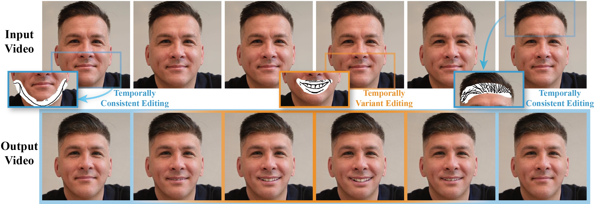

# DeepFaceVideoEditing: Sketch-based Deep Editing of Face Videos Official PyTorch implementation

## Abstract
Sketches, which are simple and concise, have been used in recent deep image synthesis methods to allow intuitive generation and editing of facial images. However, it is nontrivial to extend such methods to video editing due to various challenges, ranging from appropriate manipulation propagation and fusion of multiple editing operations to ensure temporal coherence and visual quality. To address these issues, we propose a novel sketch-based facial video editing framework, in which we represent editing manipulations in latent space and propose specific propagation and fusion modules to generate high-quality video editing results based on StyleGAN3. Specifically, we first design an optimization approach to represent sketch editing manipulations by editing vectors, which are propagated to the whole video sequence using a proper strategy to cope with different editing needs. Specifically, input editing operations are classified into two categories: temporally consistent editing and temporally variant editing. The former (e.g., change of face shape) is applied to the whole video sequence directly, while the latter (e.g., change of facial expression or dynamics) is propagated with the guidance of expression or only affects adjacent frames in a given time window. Since users often perform different editing operations in multiple frames, we further present a region-aware fusion approach to fuse diverse editing effects. Our method supports video editing on facial structure and expression movement by sketch, which cannot be achieved by previous works. Both qualitative and quantitative evaluations show the superior editing ability of our system to existing and alternative solutions.
